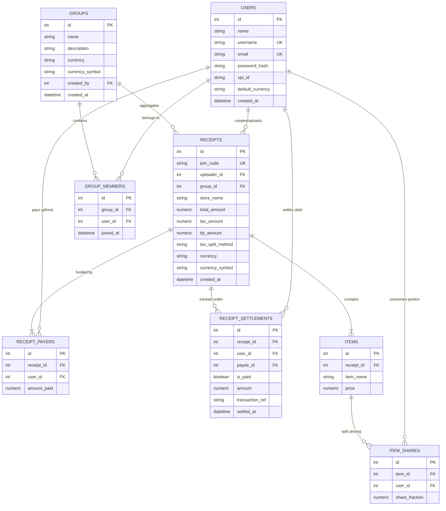

# SmartSplit - Comprehensive Architecture & Technical Documentation

> **Smart AI Expense Splitter with Gemini AI Vision, Manual Bill Creator, Multi-Payer Engine, Greedy Debt Simplification, Multi-Currency, 6-Char Private Room Codes, Tax/Tip Auto-Distributor, WhatsApp & PDF Export, and Multi-Receipt Trip Aggregator.**

---

## 📌 1. Executive Summary & Capabilities

**SmartSplit** is a full-stack, mobile-first web application engineered to solve the real-world friction of splitting dining, travel, shopping, and shared apartment expenses among friends, roommates, and travel groups.

### Key Capabilities

1. **AI Receipt Digitization & OCR**: Instantly extracts items, prices, taxes, and store information from receipt photos using Google Gemini Vision.
2. **Manual Bill Creation & Item Editor**: Create custom bills without photos, edit item names/prices, add new items, or delete items with real-time total recalculation.
3. **Granular Item Portion Splits**: Select exact portions per product (`Full (1/1)`, `1/2 Half`, `1/3 Third`, `1/4 Quarter`, or `/N` Custom Denominator).
4. **Native Multi-Payer Engine**: Split the upfront restaurant bill when **2 or more people** pay at the cash counter (e.g., Alice pays ₹600 and Bob pays ₹400 on a ₹1,000 bill).
5. **Tax, Tip & Service Charge Auto-Distributor**: Configure tax & tip amounts with selectable distribution methods (**Proportional to items consumed** or **Equal split**).
6. **Smart Debt Simplification (Splitwise-style Greedy Algorithm)**: Computes Net Balances and simplifies payment transfers to the minimum possible number of transactions.
7. **Multi-Currency Support**: Full support for `₹ INR`, `$ USD`, `€ EUR`, `£ GBP`, `د.إ AED`, `C$ CAD`, `S$ SGD`, `A$ AUD`, `¥ JPY`, `CHF CHF`.
8. **6-Character Private Room Join Codes**: Auto-generates collision-safe alphanumeric codes (e.g., `CAFE92`, `7FSKUB`) so guests can join directly.
9. **1-Tap WhatsApp & PDF / Print Export**: Formatted WhatsApp message generator with emojis, store details, and direct payment breakdown.
10. **Trip & Group Multi-Receipt Aggregator**: Combine multiple hotel, food, fuel, and travel receipts under a single Trip (e.g. "Goa Weekend 2026") with **Consolidated Multi-Bill Settlement**.
11. **1-Tap Direct UPI Settlement**: Deep links directly to GPay, PhonePe, Paytm, Cred, or displays dynamic QR codes on desktop.
12. **Persistent Database Memory**: User accounts, past expense history, and payment statuses are securely recorded in SQLite / PostgreSQL.

---

## 🏗️ 2. Tech Stack & System Architecture

```
                                    +-----------------------------------------+
                                    |         Client / Frontend (PWA)         |
                                    |  • Responsive Vanilla HTML5 + CSS + JS  |
                                    |  • TailwindCSS via CDN (Glassmorphism)  |
                                    |  • Service Worker (sw.js) & PWA Manifest|
                                    +--------------------+--------------------+
                                                         |
                                                    REST / HTTP
                                                         |
                                                         v
                                    +--------------------+--------------------+
                                    |       FastAPI Backend (Python 3.10+)    |
                                    |  • CORS Middleware & Auto Static Serving|
                                    |  • SQLAlchemy ORM (SQLite / PostgreSQL) |
                                    |  • Pydantic v2 Schema Validation        |
                                    +---------+-------------------+-----------+
                                              |                   |
                     +------------------------+                   +-----------------------+
                     v                                                                    v
+--------------------+--------------------+                      +------------------------+--------------------+
|         Google Gemini 1.5 / 2.0         |                      |            Database Layer (RDBMS)          |
|  • OCR & Vision Receipt Extraction      |                      |  • Users, Groups, GroupMembers, Receipts    |
|  • Structured JSON Parsing via Prompt   |                      |  • Items, ItemShares, Payers, Settlements  |
+-----------------------------------------+                      +---------------------------------------------+
```

### Technology Highlights
- **Backend Framework**: [FastAPI](https://fastapi.tiangolo.com/) with asynchronous endpoint support.
- **AI / LLM Integration**: [Google Gemini Vision API](https://ai.google.dev/) via `google-generativeai`.
- **Database & ORM**: [SQLAlchemy](https://www.sqlalchemy.org/) supporting SQLite for local development and PostgreSQL for production deployments (Render / Heroku / Docker).
- **Frontend**: Single-Page Application ([index.html](file:///d:/projects/Split-Expense-App/index.html)) featuring Dark & Light mode, PWA capabilities, real-time polling, and UPI deeplinking.

---

## 🗄️ 3. Database Schema Design

The database schema is defined in [app/models.py](file:///d:/projects/Split-Expense-App/app/models.py):



---

## 🧮 4. Mathematical Core: Multi-Payer & Debt Simplification

### 4.1 Tax & Tip Distribution Formulas

Let $S_{\text{items}}$ be the sum of all item prices:
$$S_{\text{items}} = \sum_{i \in \text{Items}} \text{Price}_i$$

Let $E = \text{Tax} + \text{Tip}$ be the total additional charges.

1. **Proportional Split Method**:
   Each user $u$'s share of tax/tip is proportional to their item consumption:
   $$\text{TaxTip}_u = \left(\frac{\text{ConsumedItems}_u}{S_{\text{items}}}\right) \times E$$

2. **Equal Split Method**:
   $$\text{TaxTip}_u = \frac{E}{N_{\text{participants}}}$$

Total consumed cost for user $u$:
$$\text{ConsumedCost}_u = \text{ConsumedItems}_u + \text{TaxTip}_u$$

### 4.2 Net Balance Formulation

For each user $u$:
$$\text{NetBalance}_u = \text{AmountPaidUpfront}_u - \text{ConsumedCost}_u$$

- If $\text{NetBalance}_u > 0$: User is a **Creditor** (is owed money).
- If $\text{NetBalance}_u < 0$: User is a **Debtor** (owes money).
- If $\text{NetBalance}_u = 0$: User is **Balanced** (no transactions needed).

### 4.3 Greedy Debt Simplification Algorithm

Implemented in [app/services/split_service.py](file:///d:/projects/Split-Expense-App/app/services/split_service.py):

```python
def simplify_debts(balances: dict[int, float]) -> list[dict]:
    debtors = [{'user_id': uid, 'amount': -bal} for uid, bal in balances.items() if bal < -0.009]
    creditors = [{'user_id': uid, 'amount': bal} for uid, bal in balances.items() if bal > 0.009]

    debtors.sort(key=lambda x: x['amount'], reverse=True)
    creditors.sort(key=lambda x: x['amount'], reverse=True)

    transfers = []
    i, j = 0, 0
    while i < len(debtors) and j < len(creditors):
        debtor = debtors[i]
        creditor = creditors[j]
        settle_amt = min(debtor['amount'], creditor['amount'])

        if settle_amt > 0.009:
            transfers.append({
                'from_user_id': debtor['user_id'],
                'to_user_id': creditor['user_id'],
                'amount': round(settle_amt, 2)
            })
            debtor['amount'] = round(debtor['amount'] - settle_amt, 2)
            creditor['amount'] = round(creditor['amount'] - settle_amt, 2)

        if debtor['amount'] < 0.01:
            i += 1
        if creditor['amount'] < 0.01:
            j += 1

    return transfers
```

### 4.4 Consolidated Trip Aggregator

When multiple receipts belong to a group (`group_id`):
$$\text{TotalGroupPaid}_u = \sum_{r \in \text{TripReceipts}} \text{AmountPaid}_{u, r}$$
$$\text{TotalGroupConsumed}_u = \sum_{r \in \text{TripReceipts}} \text{ConsumedCost}_{u, r}$$
$$\text{GroupNetBalance}_u = \text{TotalGroupPaid}_u - \text{TotalGroupConsumed}_u$$

Running `simplify_debts` across $\text{GroupNetBalance}$ produces a single unified set of payment transfers for the entire weekend trip!

---

## 📡 5. REST API Reference

### 5.1 Authentication (`/auth`)
- `POST /auth/register`: Register user account with optional `default_currency`.
- `POST /auth/login`: Authenticate and receive auth token.
- `PUT /auth/user/{user_id}/upi`: Update user's personal receiving UPI ID.
- `PUT /auth/user/{user_id}/currency`: Update user's default currency preference.
- `GET /auth/user/{user_id}`: Retrieve profile information.

### 5.2 Receipts & Items (`/receipts`)
- `POST /receipts/scan`: Upload photo for Gemini AI OCR parsing and auto join code generation.
- `POST /receipts/manual`: Create custom receipt manually without an image.
- `GET /receipts/{receipt_id}`: Retrieve receipt by ID.
- `GET /receipts/code/{join_code}`: Retrieve receipt by 6-character private alphanumeric code.
- `POST /receipts/{receipt_id}/items`: Add a new item to an existing receipt.
- `PUT /receipts/{receipt_id}/items/{item_id}`: Edit item name or price.
- `DELETE /receipts/{receipt_id}/items/{item_id}`: Remove item and its shares.
- `PUT /receipts/{receipt_id}/tax-tip`: Update tax, tip, and distribution method (`proportional` / `equal`).
- `PUT /receipts/{receipt_id}/currency`: Switch receipt currency.
- `GET /receipts/history/user/{user_id}`: Get user's complete expense history.

### 5.3 Splitting & Settlements (`/split`)
- `GET /split/payers/{receipt_id}`: Fetch list of upfront payers.
- `POST /split/payers`: Save or update multiple payers for a receipt.
- `POST /split/assign-user-shares`: Save item share assignments.
- `GET /split/summary/{receipt_id}`: Calculate real-time net balances and smart transfers.
- `POST /split/settle`: Record payment settlement status.

### 5.4 Trips & Groups (`/groups`)
- `POST /groups`: Create new group/trip with members.
- `GET /groups/user/{user_id}`: List all groups the user created or joined.
- `GET /groups/{group_id}`: Get group details, member roster, and all receipts.
- `POST /groups/{group_id}/members`: Add user to group.
- `POST /groups/{group_id}/receipts/{receipt_id}`: Link existing receipt to trip.
- `DELETE /groups/{group_id}/receipts/{receipt_id}`: Unlink receipt from trip.
- `GET /groups/{group_id}/summary`: Multi-receipt consolidated trip settlement calculation.

---

## 🚀 6. Setup & Deployment Instructions

### Local Development
```bash
# 1. Clone repository
git clone https://github.com/pradnya-devendra-ukey/Split-Expense-App.git
cd Split-Expense-App

# 2. Setup Virtual Environment
python -m venv venv
.\venv\Scripts\activate

# 3. Install Dependencies
pip install -r requirements.txt

# 4. Configure .env
# GEMINI_API_KEY="AIzaSy..."
# DATABASE_URL="sqlite:///./expense.db"

# 5. Launch FastAPI Dev Server
uvicorn app.main:app --reload --host 0.0.0.0 --port 8000
```

### Production Deployment (Render / Docker)
The application includes a `render.yaml`, `Dockerfile`, and `docker-compose.yml` for zero-configuration container deployment on Render, Fly.io, Railway, or AWS.
